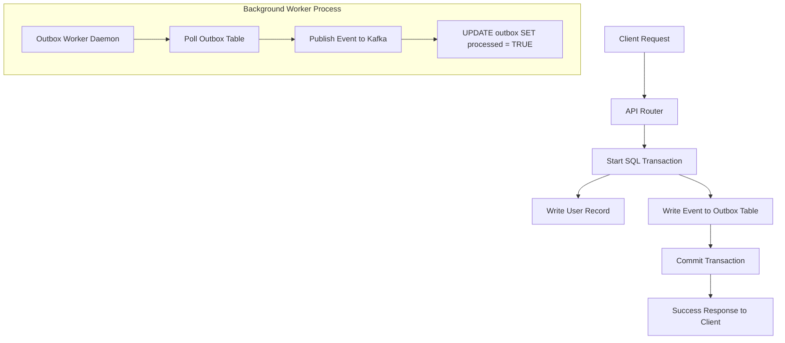

# Kafka Integration Guide

This document describes how **Apache Kafka** is used within the Granthan Auth Service, focusing on the **Transactional Outbox Pattern**, async worker mechanics, and producer optimizations.

---

## 1. Architectural Architecture: The Transactional Outbox Pattern

In a microservices architecture, when a state change occurs (e.g., a new user registers or verifies their email), we must notify other downstream microservices (like the *Notification Service*). 

If we try to write to the database and publish to Kafka in the same HTTP request, we face the **Dual-Write Problem**:
1. **Scenario A (Database commits, Kafka fails):** The user profile is created, but the message publish fails (Kafka is offline). Downstream services never receive the event, resulting in a broken registration loop.
2. **Scenario B (Kafka succeeds, Database rolls back):** The event is published to Kafka, but the database transaction fails and rolls back. Downstream services start processing a user that does not exist in the database.

### The Solution: Transactional Outbox
Instead of publishing directly to Kafka from our API endpoints, we save the event payload to a dedicated **`outbox`** database table in PostgreSQL within the **same local database transaction** as the user profile update.



---

## 2. Outbox Schema & Worker Mechanics

### 2.1 The Outbox Database Table
Located in: [app/models/outbox.py](file:///c:/Users/hp/Desktop/Granthan/auth-service/app/models/outbox.py)

```sql
CREATE TABLE outbox (
    id UUID PRIMARY KEY DEFAULT gen_random_uuid(),
    event_type VARCHAR(100) NOT NULL,
    payload JSONB NOT NULL,
    processed BOOLEAN NOT NULL DEFAULT FALSE,
    created_at TIMESTAMP WITH TIME ZONE DEFAULT NOW()
);
```

### 2.2 The Outbox Worker Daemon Loop
Located in: [app/workers/outbox_worker.py](file:///c:/Users/hp/Desktop/Granthan/auth-service/app/workers/outbox_worker.py)

The outbox worker runs on an asynchronous polling loop (e.g., every 2 seconds). To ensure **At-Least-Once Delivery** and prevent multiple worker instances from processing the same events simultaneously, the worker queries the database using **`FOR UPDATE SKIP LOCKED`**:

```python
result = await db.execute(
    select(Outbox)
    .where(Outbox.processed == False)
    .order_by(Outbox.created_at.asc())
    .limit(settings.OUTBOX_BATCH_SIZE)
    .with_for_update(skip_locked=True) # <-- Concurrency Lock
)
```
* **Why `skip_locked`?** If you run multiple instances of the Auth Service container behind a load balancer, each instance running this background worker will skip row locks held by other active instances. This prevents duplicate processing and deadlocks.

---

## 3. Producer Optimizations

Located in: [app/events/producer.py](file:///c:/Users/hp/Desktop/Granthan/auth-service/app/events/producer.py)

Our asynchronous Kafka producer (`AIOKafkaProducer`) is tuned with these production configurations:

* **`enable_idempotence=True`:** Ensures that duplicate writes are automatically discarded by the broker if network retries occur. It preserves the exact message ordering.
* **`acks="all"`:** The producer waits for all in-sync replicas (ISRs) to write the message to disk before returning success, guaranteeing **zero data loss**.
* **`compression_type="gzip"`:** Message payloads are JSON strings. Compressing them with GZIP reduces network bandwidth and disk storage footprint by **60% to 80%**.
* **`linger_ms=5`:** The client wait buffer (5 milliseconds) groups multiple outgoing write requests into a single network batch, massively improving throughput under high request volumes.

---

## 4. Event Payloads (Pydantic Schemas)

Located in: [app/events/auth_events.py](file:///c:/Users/hp/Desktop/Granthan/auth-service/app/events/auth_events.py)

All events share a common structure with unique IDs and UTC timestamps:

### 4.1 `UserRegistered`
* **Topic:** `user-events`
* **Trigger:** Triggered when `POST /auth/register` completes successfully.
* **Payload:**
  ```json
  {
    "event_id": "90e66c6b-67a6-44ec-b850-8b2cf2724ad7",
    "timestamp": "2026-07-24T14:40:00Z",
    "user_id": "27131a6e-0267-49cd-ab5a-5955a423d505",
    "email": "shubh@gmail.com",
    "full_name": "Soubhagya Srivastava"
  }
  ```

### 4.2 `EmailVerified`
* **Topic:** `user-events`
* **Trigger:** Triggered when `POST /auth/verify-email` matches code and activates user.
* **Payload:**
  ```json
  {
    "event_id": "c1a01b22-80ba-4700-a01b-c12e52c900fb",
    "timestamp": "2026-07-24T14:42:00Z",
    "user_id": "27131a6e-0267-49cd-ab5a-5955a423d505",
    "email": "shubh@gmail.com"
  }
  ```

### 4.3 `PasswordReset`
* **Topic:** `user-events`
* **Trigger:** Triggered when `POST /auth/reset-password` updates credentials.
* **Payload:**
  ```json
  {
    "event_id": "d09a341b-a12b-4261-b928-868c220f12da",
    "timestamp": "2026-07-24T14:45:00Z",
    "user_id": "27131a6e-0267-49cd-ab5a-5955a423d505",
    "email": "shubh@gmail.com"
  }
  ```
