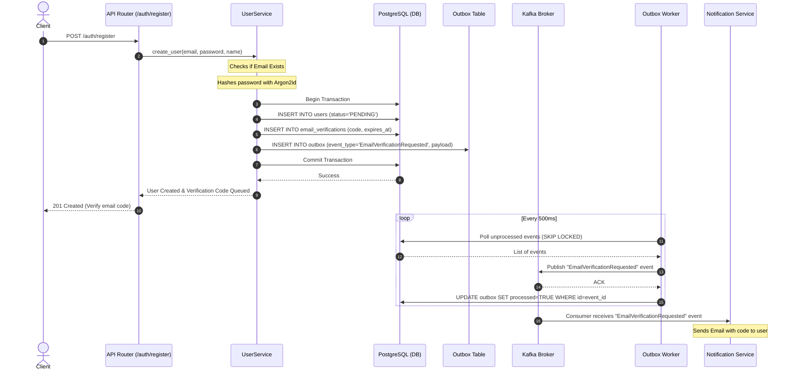
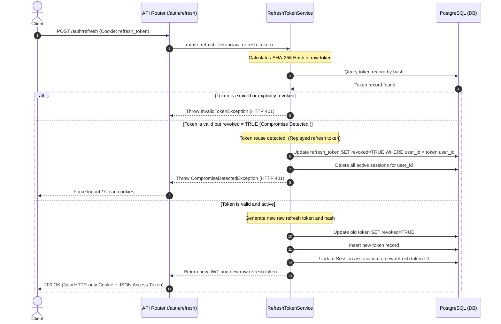

# Low-Level Design (LLD) - Granthan Auth Service

This document provides a detailed, production-grade Low-Level Design (LLD) for the **Granthan Auth Service**, mapping directly to the directory structure and the guidelines established in the High-Level Design (HLD).

---

## 1. Directory to Module Mapping: Where, Why, and How

Here is a comprehensive breakdown of the file structure, detailing the responsibility (**What**), the justification (**Why**), and the design pattern or mechanism (**How**) for each file.

```text
auth-service/
├── app/
│   ├── api/
│   │   ├── deps.py                  # HTTP dependency injection (DB sessions, current user, rate limit check)
│   │   ├── middleware.py             # FastAPI middleware (CORS, Trace/Correlation ID, Security Headers)
│   │   ├── routers/                  # API endpoint groups
│   │   │   ├── auth.py               # Register, Login, Refresh, Logout, Email Verification
│   │   │   ├── users.py              # Profile management, password changes
│   │   │   ├── sessions.py           # Device session listing and revocation
│   │   │   └── health.py             # Readiness and liveness checks (DB and Redis check)
│   │   └── schemas/                  # Pydantic serialization/deserialization schemas
│   │       ├── auth.py               # Login request, Registration request, Token schemas
│   │       ├── user.py               # UserResponse, ProfileUpdateRequest schemas
│   │       ├── session.py            # SessionResponse schema
│   │       └── common.py             # Error responses, generic Paginated/Success models
│   ├── services/                    # Core business logic layer (stateless, orchestration)
│   │   ├── auth_service.py           # High-level auth logic (orchestrates Identity, Session, Token services)
│   │   ├── user_service.py           # User account creation, update, email verification status update
│   │   ├── password_service.py       # Interacts with hasher and validators
│   │   ├── jwt_service.py            # Generates/verifies short-lived access JWTs
│   │   ├── refresh_token_service.py  # Manages refresh token rotation and hashing
│   │   ├── session_service.py        # Validates and records active device sessions
│   │   ├── verification_service.py   # Code generation, DB storage, and Redis matching
│   │   ├── password_reset_service.py # Recover account flows (token issuance/validation)
│   │   └── audit_service.py          # Asynchronous audit log writing
│   ├── repositories/                # Database abstraction layer (SQLAlchemy queries)
│   │   ├── user_repository.py
│   │   ├── refresh_token_repository.py
│   │   ├── session_repository.py
│   │   ├── verification_repository.py
│   │   ├── password_reset_repository.py
│   │   └── audit_repository.py
│   ├── models/                      # SQLAlchemy models mapped to PostgreSQL tables
│   │   ├── user.py
│   │   ├── refresh_token.py
│   │   ├── session.py
│   │   ├── email_verification.py
│   │   ├── password_reset.py
│   │   └── audit_log.py
│   ├── security/                    # Cryptographic and sanitization modules
│   │   ├── password_hasher.py        # Argon2id hashing implementation
│   │   ├── jwt_manager.py            # Raw PyJWT encoding, decoding, and secret handling
│   │   ├── token_generator.py        # Cryptographically secure random bytes generation
│   │   ├── rate_limiter.py           # Redis sliding window rate-limiter logic
│   │   └── validators.py             # Strong password rules and email pattern matchers
│   ├── events/                      # Asynchronous event handling
│   │   ├── producer.py               # Kafka producer interface
│   │   ├── topics.py                 # Topic name constants
│   │   ├── auth_events.py            # Event models (Pydantic payload definitions)
│   │   └── outbox_publisher.py       # Outbox table poll-and-publish interface
│   ├── cache/                       # Redis caching adapters
│   │   ├── redis.py                  # Redis Client pool initialization
│   │   ├── login_attempt_cache.py    # Tracks failed login attempts (Account Lockout)
│   │   └── verification_cache.py     # Short-lived OTPs cache
│   ├── db/                          # Database connection and migration management
│   │   ├── postgres.py               # SQLAlchemy async engine configuration
│   │   ├── session.py                # Database session generator (async sessionmaker)
│   │   ├── base.py                   # Declares SQLAlchemy Base (imports all models)
│   │   └── migrations/               # Alembic auto-generated schema migrations
│   ├── core/                        # Global configs and constants
│   │   ├── config.py                 # Pydantic Settings (loads environment variables)
│   │   ├── logging.py                # Structured JSON logging config
│   │   ├── exceptions.py             # Custom exceptions and exception mapping handlers
│   │   ├── constants.py              # Application-wide static constants
│   │   └── enums.py                  # User statuses, Audit actions, Event categories
│   ├── workers/                     # Background execution units
│   │   └── outbox_worker.py          # Runs the outbox publisher loop to publish Kafka events
│   ├── utils/                       # Common stateless utilities
│   │   ├── datetime.py               # UTC timestamp normalizers
│   │   ├── device_parser.py          # Extract Browser/OS details from User-Agent header
│   │   └── ip_utils.py               # Client IP extraction with proxy headers support
│   ├── main.py                      # FastAPI application bootstrap, middlewares registration
│   └── lifespan.py                  # Startup/Shutdown tasks (DB pool, Redis pool, Kafka producer, background worker)
```

---

## 2. Database Design & Schema Details

We use **PostgreSQL** as our source of truth, optimized for ACID compliance, and **Redis** for sub-millisecond, volatile storage.

### 2.1 Database Schema (SQLAlchemy Models)

#### 1. `users` Table
Stores user account profiles and credential states.
* **SQLAlchemy Class:** `User` in `app/models/user.py`
* **Schema Definition:**
  ```sql
  CREATE TYPE user_status AS ENUM ('PENDING', 'ACTIVE', 'SUSPENDED');

  CREATE TABLE users (
      id UUID PRIMARY KEY DEFAULT gen_random_uuid(),
      email VARCHAR(255) UNIQUE NOT NULL,
      password_hash VARCHAR(255) NOT NULL,
      full_name VARCHAR(100),
      avatar_url TEXT,
      is_email_verified BOOLEAN NOT NULL DEFAULT FALSE,
      status user_status NOT NULL DEFAULT 'PENDING',
      created_at TIMESTAMP WITH TIME ZONE NOT NULL DEFAULT NOW(),
      updated_at TIMESTAMP WITH TIME ZONE NOT NULL DEFAULT NOW(),
      last_login TIMESTAMP WITH TIME ZONE
  );

  CREATE INDEX idx_users_email ON users(email);
  ```
* **Why:** Indexes are placed on `email` to guarantee $O(1)$ lookups during user login. `status` lets us suspend accounts instantly.

#### 2. `refresh_tokens` Table
Supports Refresh Token Rotation (RTR). Every token is stored as a SHA-256 hash.
* **SQLAlchemy Class:** `RefreshToken` in `app/models/refresh_token.py`
* **Schema Definition:**
  ```sql
  CREATE TABLE refresh_tokens (
      id UUID PRIMARY KEY DEFAULT gen_random_uuid(),
      user_id UUID NOT NULL REFERENCES users(id) ON DELETE CASCADE,
      token_hash VARCHAR(64) UNIQUE NOT NULL,  -- SHA-256 hash of the plain token
      expires_at TIMESTAMP WITH TIME ZONE NOT NULL,
      revoked BOOLEAN NOT NULL DEFAULT FALSE,
      created_at TIMESTAMP WITH TIME ZONE NOT NULL DEFAULT NOW()
  );

  CREATE INDEX idx_refresh_tokens_hash ON refresh_tokens(token_hash);
  ```
* **Why:** We hash the tokens in the database to prevent an attacker from gaining active sessions if the database is leaked.

#### 3. `sessions` Table
Tracks active user sessions on different devices.
* **SQLAlchemy Class:** `Session` in `app/models/session.py`
* **Schema Definition:**
  ```sql
  CREATE TABLE sessions (
      id UUID PRIMARY KEY DEFAULT gen_random_uuid(),
      user_id UUID NOT NULL REFERENCES users(id) ON DELETE CASCADE,
      refresh_token_id UUID NOT NULL REFERENCES refresh_tokens(id) ON DELETE CASCADE,
      device VARCHAR(100),
      browser VARCHAR(100),
      os VARCHAR(100),
      ip_address VARCHAR(45), -- Supports both IPv4 and IPv6
      last_seen TIMESTAMP WITH TIME ZONE NOT NULL DEFAULT NOW(),
      expires_at TIMESTAMP WITH TIME ZONE NOT NULL
  );

  CREATE INDEX idx_sessions_user_id ON sessions(user_id);
  ```
* **Why:** Linking `refresh_token_id` to the session allows deleting the session to instantly invalidate the corresponding refresh token, resulting in immediate logout.

#### 4. `email_verifications` Table
Provides single-use verify links.
* **SQLAlchemy Class:** `EmailVerification` in `app/models/email_verification.py`
* **Schema Definition:**
  ```sql
  CREATE TABLE email_verifications (
      id UUID PRIMARY KEY DEFAULT gen_random_uuid(),
      user_id UUID NOT NULL REFERENCES users(id) ON DELETE CASCADE,
      verification_code VARCHAR(6) NOT NULL, -- 6 digit numerical OTP or secure token
      expires_at TIMESTAMP WITH TIME ZONE NOT NULL,
      used BOOLEAN NOT NULL DEFAULT FALSE,
      created_at TIMESTAMP WITH TIME ZONE NOT NULL DEFAULT NOW()
  );

  CREATE INDEX idx_email_verifications_user_code ON email_verifications(user_id, verification_code);
  ```

#### 5. `password_resets` Table
Manages password reset workflows.
* **SQLAlchemy Class:** `PasswordReset` in `app/models/password_reset.py`
* **Schema Definition:**
  ```sql
  CREATE TABLE password_resets (
      id UUID PRIMARY KEY DEFAULT gen_random_uuid(),
      user_id UUID NOT NULL REFERENCES users(id) ON DELETE CASCADE,
      reset_token VARCHAR(64) UNIQUE NOT NULL, -- SHA-256 hash of the generated path token
      expires_at TIMESTAMP WITH TIME ZONE NOT NULL,
      used BOOLEAN NOT NULL DEFAULT FALSE,
      created_at TIMESTAMP WITH TIME ZONE NOT NULL DEFAULT NOW()
  );

  CREATE INDEX idx_password_resets_token ON password_resets(reset_token);
  ```

#### 6. `audit_logs` Table
A ledger of security-relevant operations.
* **SQLAlchemy Class:** `AuditLog` in `app/models/audit_log.py`
* **Schema Definition:**
  ```sql
  CREATE TABLE audit_logs (
      id UUID PRIMARY KEY DEFAULT gen_random_uuid(),
      user_id UUID REFERENCES users(id) ON DELETE SET NULL, -- Keep logs if user is deleted
      action VARCHAR(50) NOT NULL, -- e.g., 'LOGIN_SUCCESS', 'PASSWORD_RESET_REQUESTED'
      ip_address VARCHAR(45),
      user_agent TEXT,
      metadata JSONB, -- Additional details (e.g. failed reasons, browser signatures)
      created_at TIMESTAMP WITH TIME ZONE NOT NULL DEFAULT NOW()
  );

  CREATE INDEX idx_audit_logs_user_id ON audit_logs(user_id);
  ```

#### 7. `outbox` Table (Transactional Outbox Pattern)
Ensures Event-Driven reliability with Kafka.
* **SQLAlchemy Class:** `Outbox` in `app/models/outbox.py`
* **Schema Definition:**
  ```sql
  CREATE TABLE outbox (
      id UUID PRIMARY KEY DEFAULT gen_random_uuid(),
      event_type VARCHAR(100) NOT NULL,
      payload JSONB NOT NULL,
      processed BOOLEAN NOT NULL DEFAULT FALSE,
      created_at TIMESTAMP WITH TIME ZONE NOT NULL DEFAULT NOW()
  );

  CREATE INDEX idx_outbox_unprocessed ON outbox(created_at) WHERE processed = FALSE;
  ```
* **Why:** In microservices, updating the DB and writing directly to Kafka can fail mid-transaction (Dual Write Problem). Writing the event payload to the `outbox` table in the *same database transaction* as the auth action guarantees **At-Least-Once Delivery**.

---

### 2.2 Redis Keyspace Design

Redis is used to store high-read, ephemeral variables.

| Namespace | Key Format | Value | TTL | Eviction Policy | Purpose |
| :--- | :--- | :--- | :--- | :--- | :--- |
| **Verification OTP** | `otp:{user_id}` | `6-digit string` | 15 Mins | `volatile-lru` | Validate OTP for registration or resending limits. |
| **Login Attempts** | `failed_attempts:{email}` | `Integer counter` | 30 Mins | `volatile-lru` | Increments count on failed logins to trigger lockout. |
| **IP Rate Limit** | `rate:{ip_address}:{endpoint}` | `Integer counter` | 1 Min | `volatile-lru` | Fixed/sliding window bucket for request throttling. |
| **Token Blacklist** | `blacklist:{jwt_jti}` | `1` | Remaining JWT duration | `noeviction` | Invalidates active JWT access tokens upon explicit logout. |

---

## 3. Internal Components & Modules

### 3.1 Identity & Password Validation
* **Security Location:** `app/security/password_hasher.py`
  * Hashing mechanism: **Argon2id**.
  * Parameter standard:
    * `time_cost`: 3 passes
    * `memory_cost`: 65536 KiB (64 MiB)
    * `parallelism`: 4 threads
    * `hash_len`: 32 bytes
  * Validation rules (`app/security/validators.py`):
    * Minimum length: 12 characters.
    * Character complexity: At least 1 uppercase letter, 1 lowercase letter, 1 digit, and 1 special symbol.
    * Common lists checking: Checks against standard dictionary words and the user's own email substring.

### 3.2 Token and Refresh Token Architecture
* **JWT Access Token Structure (`app/security/jwt_manager.py`):**
  * Algorithm: **HS256** (or RS256 using asymmetric public/private keys if other services need to verify claims locally without calling the auth database). Here, we utilize **RS256** for distributed decoupling: only Auth Service signs, downstream API Gateway/services verify using the public key.
  * Claims Payload:
    ```json
    {
      "iss": "https://auth.granthan.com",
      "sub": "b2c1a01b-c40d-4e96-a8a5-dcd76be135bb",
      "email": "user@example.com",
      "email_verified": true,
      "jti": "8f8b3df9-cf0a-4a25-a4b5-5553e1a067bb",
      "iat": 1782218000,
      "exp": 1782218900
    }
    ```
* **Refresh Token Rotation (RTR) Mechanism:**
  * When a user requests a new Access Token using their Refresh Token:
    1. Look up the token record by SHA-256 hash.
    2. Check expiration (`expires_at < now`) and revocation status.
    3. **Token Reuse Detection:** If the refresh token has already been revoked or marked as used, **compromise detection** triggers. This revokes all descendant and ancestor refresh tokens for that family (associated user) immediately, requiring a force logout of all sessions.
    4. Otherwise, generate a *new* Refresh Token, save its hash, revoke the *old* one, and issue the new Access Token + Refresh Token tuple.

### 3.3 Session Management
* **Location:** `app/services/session_service.py`
* **Device details extraction (`app/utils/device_parser.py`):**
  * Uses the `ua-parser` library to read User-Agent strings.
  * Parsed results are mapped into structured database attributes: `browser` (e.g., Chrome 124), `os` (e.g., macOS Sonoma), and `device` (e.g., Apple Macintosh).
* **Sliding Session Expiration:**
  * In the auth verify pipeline, if the session's `last_seen` timestamp is older than 5 minutes, we execute an async background update to set `last_seen = NOW()`.
  * The session automatically expires on `expires_at`. Revocation deletes the session from the DB and pushes the associated JWT `jti` to the Redis blacklist.

### 3.4 Verification & Password Reset
* **Location:** `app/services/verification_service.py` and `password_reset_service.py`
* **Verification Loop:**
  1. Generate a cryptographically secure 6-digit verification code.
  2. Write verification details to database (`email_verifications`) and Redis caching adapter.
  3. Commit transaction alongside transactional outbox queueing a `EmailVerificationRequested` event.
  4. Once verified, flip `is_email_verified = TRUE` and set user status to `ACTIVE`.

### 3.5 Transactional Outbox Worker
* **Location:** `app/workers/outbox_worker.py`
* **Mechanism:**
  * Background loop running concurrently in the FastAPI lifecyle (or as a separate container running the same codebase).
  * Executes a polling query:
    ```sql
    SELECT * FROM outbox WHERE processed = FALSE ORDER BY created_at ASC LIMIT 100 FOR UPDATE SKIP LOCKED;
    ```
  * For each record:
    1. Publish payload to Kafka topic configured under `app/events/topics.py`.
    2. Upon receiving successful Kafka ACK, mark the record as `processed = TRUE` (or delete to maintain database size).
  * **Why:** Prevents message loss on Kafka down-times, guaranteeing eventual delivery consistency.

---

## 4. API Specification & Payload Definitions

Below are the key API endpoints with input and output validation specifications.

### 4.1 Public APIs (Unauthenticated)

#### 1. Registration: `POST /auth/register`
* **Request Schema (`RegisterRequest`):**
  ```json
  {
    "email": "user@example.com",
    "password": "StrongPassword123!",
    "full_name": "John Doe"
  }
  ```
* **Validation Rules:**
  * `email`: valid RFC 5322 format.
  * `password`: minimum 12 chars, mixed case, symbols.
* **Response (Status 201 Created):**
  ```json
  {
    "user_id": "b2c1a01b-c40d-4e96-a8a5-dcd76be135bb",
    "email": "user@example.com",
    "status": "PENDING",
    "message": "Verification code sent to registered email address."
  }
  ```

#### 2. Login: `POST /auth/login`
* **Request Schema (`LoginRequest`):**
  ```json
  {
    "email": "user@example.com",
    "password": "StrongPassword123!"
  }
  ```
* **Response (Status 200 OK - Sets secure HTTP-only cookies for tokens):**
  * Body:
    ```json
    {
      "access_token": "eyJhbGciOiJSUzI1NiIs...",
      "token_type": "bearer",
      "expires_in": 900
    }
    ```
  * Cookies Set:
    `refresh_token=...; HttpOnly; Secure; SameSite=Strict; Path=/auth/refresh; Max-Age=2592000`

---

## 5. Sequence Flows

### 5.1 Registration Flow (With Outbox Pattern)



### 5.2 Token Refresh Flow (With Rotation and Reuse Detection)



---

## 6. Security Hardening Policies

1. **HttpOnly Cookies**: All Refresh Tokens are stored and read from secure cookies. Javascript contexts running in the browser cannot read them, which mitigates **Cross-Site Scripting (XSS)** access token leakage.
2. **SameSite=Strict**: Restricts cookie inheritance during cross-domain navigations to block **Cross-Site Request Forgery (CSRF)**.
3. **Database Salt Hashing**: All refresh and recovery tokens are hashed (SHA-256) inside the database. A database dump does not compromise active user sessions.
4. **Argon2id settings**: Protects against CPU-bound GPU mining attacks during dictionary sweeps of dumped user tables.
5. **Rate Limiting**: Integrated at the route layer. Any burst exceeding 5 attempts/minute on `/auth/login` blocks IPs locally inside Redis.
6. **Outbox Event Isolation**: Decouples the Auth DB from the Event Bus. The database does not suffer performance penalties or lockouts if Kafka is unavailable.
