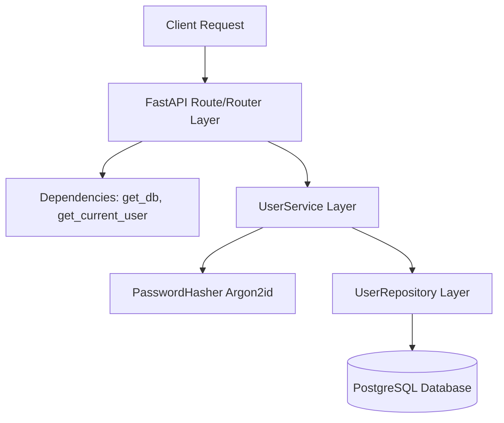
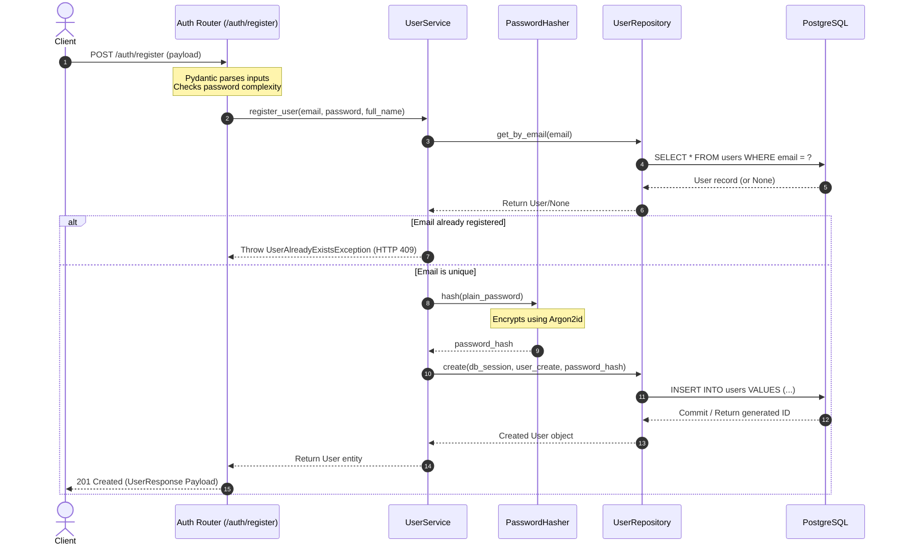
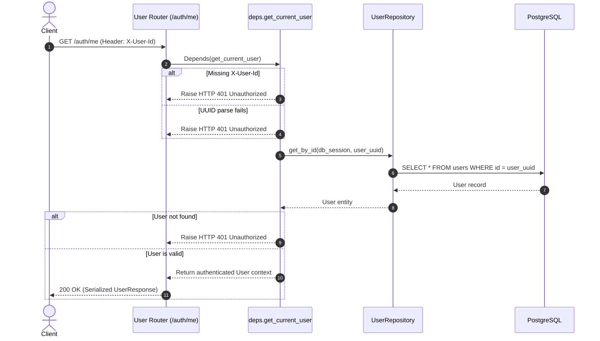

# Task Complete 1: Identity Module Implementation & Core Configuration

This document provides a comprehensive log of the initialization, architecture, and implementations completed for the **Granthan Auth Service** under Phase 1.

---

## 1. What Was Done

Under this phase, the core structure of the authentication microservice was built, dependencies were synchronized, the local PostgreSQL database was provisioned, and the **Identity Module** was fully implemented.

### Summary of Created & Configured Components:
1. **Directory Structure & Boilerplates:** Generated the initial modular layout separating API routes, models, services, repositories, configurations, and utilities.
2. **Environment & Dependency Configurations:**
   * Declared python environment configurations in [.gitignore](file:///c:/Users/hp/Desktop/Granthan/auth-service/.gitignore).
   * Formulated env variables in [.env](file:///c:/Users/hp/Desktop/Granthan/auth-service/.env) and [.env.example](file:///c:/Users/hp/Desktop/Granthan/auth-service/.env.example).
   * Configured Pydantic Settings wrapper in [config.py](file:///c:/Users/hp/Desktop/Granthan/auth-service/app/core/config.py).
   * Setup packages tracking using `uv` inside [pyproject.toml](file:///c:/Users/hp/Desktop/Granthan/auth-service/pyproject.toml).
3. **Database & Connection Layer:**
   * Asyncpg connection pool mapping inside [postgres.py](file:///c:/Users/hp/Desktop/Granthan/auth-service/app/db/postgres.py).
   * Transactional session context factory in [session.py](file:///c:/Users/hp/Desktop/Granthan/auth-service/app/db/session.py).
   * Base SQLAlchemy model definition in [base.py](file:///c:/Users/hp/Desktop/Granthan/auth-service/app/db/base.py).
4. **Identity Module Execution Layers:**
   * SQLAlchemy [User](file:///c:/Users/hp/Desktop/Granthan/auth-service/app/models/user.py) database schema model.
   * Input/Output validation schemas in [user.py](file:///c:/Users/hp/Desktop/Granthan/auth-service/app/api/schemas/user.py) (includes password complexity checking).
   * Custom domain exceptions mapping in [exceptions.py](file:///c:/Users/hp/Desktop/Granthan/auth-service/app/core/exceptions.py).
   * Repository queries handler in [user_repository.py](file:///c:/Users/hp/Desktop/Granthan/auth-service/app/repositories/user_repository.py).
   * Business service logic in [user_service.py](file:///c:/Users/hp/Desktop/Granthan/auth-service/app/services/user_service.py).
   * API endpoints (`GET /auth/me`, `PATCH /auth/profile`, `POST /auth/register`) in [users.py](file:///c:/Users/hp/Desktop/Granthan/auth-service/app/api/routers/users.py) and [auth.py](file:///c:/Users/hp/Desktop/Granthan/auth-service/app/api/routers/auth.py).
5. **Security & Cryptography:**
   * Password hashing utility via [password_hasher.py](file:///c:/Users/hp/Desktop/Granthan/auth-service/app/security/password_hasher.py) using Argon2id.
6. **Automation scripts:**
   * Created database creation and migration script [init_db.py](file:///c:/Users/hp/Desktop/Granthan/auth-service/init_db.py) to check and build tables.

---

## 2. Why It Was Done

* **Microservices Decoupling:** Separating routers, service layer (business logic), repository layer (SQL mapping), and database engines guarantees that alterations to the database schema or hashing specifications do not leak into routing controllers.
* **Non-Blocking Asynchronous IO:** Connecting to PostgreSQL via `asyncpg` and running queries asynchronously keeps the FastAPI event loop unblocked. This allows handling thousands of concurrent user queries.
* **Argon2id for Passwords:** Argon2id is the current industry gold standard (winner of the Password Hashing Competition). It offers parameters for time cost, memory size, and parallel CPU usage, making it resistant to GPU/ASIC-based dictionary attacks.
* **Isolated Testing Context:** Injecting dependencies dynamically using `Depends` allows testing HTTP endpoints in isolation. For example, the temporary `X-User-Id` header dependency allows testing profile updates before implementing the Token JWT verification module.

---

## 3. How It Was Done

1. **Configuration Loading:** Pydantic Settings reads `.env` variables, converting strings into appropriate types (e.g. string URL, integers). It registers it in a global configuration object.
2. **Dependency Synchronization:** Executed `uv sync` to download and link compiled versions of FastAPI, Starlette, SQLAlchemy, and asyncpg.
3. **Database Bootstrap:**
   * Connected to the default database context (`postgres`) to inspect if `auth_db` was present.
   * If missing, triggered a `CREATE DATABASE` execution.
   * Connected to the target database and ran `Base.metadata.create_all` using database-level schema reflection.
4. **App Execution:** Booted Uvicorn reloading process pointing to the entry FastAPI app mapping endpoints to open ports.

---

## 4. Sequence & Architecture Flows

### 4.1 Layer Dependency Flow
This diagram illustrates the separation of layers and how dependencies flow unidirectionally from the HTTP request down to the persistence layer.



### 4.2 Onboarding Workflow (`POST /auth/register`)
This sequence demonstrates checking for duplicates, encrypting password strings, and committing transaction logs.



### 4.3 Profile Lookup Workflow (`GET /auth/me`)
How the header credentials parameter verifies context and loads profile data.



---

## 5. Code Explanations

### 5.1 Password Hashing Adapter
Located in: [app/security/password_hasher.py](file:///c:/Users/hp/Desktop/Granthan/auth-service/app/security/password_hasher.py)

```python
from argon2 import PasswordHasher as ArgonPasswordHasher
from argon2.exceptions import VerifyMismatchError

class PasswordHasher:
    # 1. Configured with secure parameters chosen to resist offline attacks
    _ph = ArgonPasswordHasher(
        time_cost=3,          # number of passes over memory
        memory_cost=65536,    # memory usage in KiB (64 MiB)
        parallelism=4,        # number of parallel threads
        hash_len=32           # length of output hash
    )

    @classmethod
    def hash(cls, password: str) -> str:
        # Hashes plain password text safely returning the hash string
        return cls._ph.hash(password)

    @classmethod
    def verify(cls, password_hash: str, password: str) -> bool:
        # Handles verification safely, mapping exceptions to boolean flags
        try:
            return cls._ph.verify(password_hash, password)
        except VerifyMismatchError:
            return False
        except Exception:
            return False
```
* **Why it matters:** Hashing is entirely asynchronous and non-reversible. By setting `memory_cost=65536`, it requires any attacker cracking dumped hashes to spend massive computing memory per guess, neutralizing multi-threaded GPU rigs.

### 5.2 Dynamic Pydantic Validation Constraints
Located in: [app/api/schemas/user.py](file:///c:/Users/hp/Desktop/Granthan/auth-service/app/api/schemas/user.py)

```python
class UserCreate(BaseModel):
    email: EmailStr
    password: str = Field(..., min_length=12, max_length=128)
    full_name: str | None = Field(None, min_length=2, max_length=100)

    @field_validator("password")
    @classmethod
    def validate_password_strength(cls, v: str) -> str:
        # RegEx checks to enforce custom validation criteria
        if not re.search(r"[A-Z]", v):
            raise ValueError("Password must contain at least one uppercase letter.")
        if not re.search(r"[a-z]", v):
            raise ValueError("Password must contain at least one lowercase letter.")
        if not re.search(r"\d", v):
            raise ValueError("Password must contain at least one digit.")
        if not re.search(r"[!@#$%^&*(),.?\":{}|<>]", v):
            raise ValueError("Password must contain at least one special character.")
        return v
```
* **Why it matters:** Pydantic validators run on the incoming HTTP payload *before* reaching routing code. If validation fails, it automatically rejects requests with an RFC-compliant `422 Unprocessable Entity` error schema, detailing exactly what password constraints were not satisfied.

### 5.3 Asynchronous Database Query Handlers
Located in: [app/repositories/user_repository.py](file:///c:/Users/hp/Desktop/Granthan/auth-service/app/repositories/user_repository.py)

```python
class UserRepository:
    @staticmethod
    async def get_by_email(db: AsyncSession, email: str) -> User | None:
        # 1. Utilizes SQLAlchemy 2.0 select statement
        # 2. Uses func.lower to normalize lookups case-insensitively
        result = await db.execute(select(User).where(func.lower(User.email) == email.lower()))
        # 3. Extracts a single model instance, or returns None if empty
        return result.scalar_one_or_none()
```
* **Why it matters:** In SQLAlchemy 2.0, querying uses `select()` objects executed inside an async session. Normative queries like `func.lower(User.email) == email.lower()` protect against duplicate registrations containing mixed-case variants (e.g. `User@Example.com` vs `user@example.com`).

---

## 6. Design Patterns Used

### 6.1 Singleton Pattern
The **Singleton Pattern** restricts the instantiation of a class to a single, globally accessible instance.
* **Where & How:** 
  * **Application Config (`settings`):** In [config.py](file:///c:/Users/hp/Desktop/Granthan/auth-service/app/core/config.py), the `Settings` class is instantiated once as `settings = Settings()`. All modules import this instance to access environment variables case-insensitively, avoiding multiple disk/environment read operations.
  * **Database Engine (`engine`):** In [postgres.py](file:///c:/Users/hp/Desktop/Granthan/auth-service/app/db/postgres.py), the asynchronous connection pool engine `engine` is created once. It operates as a pool manager, reusing open connections rather than reconnecting on every API request.
  * **Cryptographic Hasher (`_ph`):** In [password_hasher.py](file:///c:/Users/hp/Desktop/Granthan/auth-service/app/security/password_hasher.py), the underlying `ArgonPasswordHasher` is defined as a private class attribute. The wrapper class exposes static methods while keeping this single instance active in memory.

---

### 6.2 Dependency Injection (DI) Pattern
The **Dependency Injection Pattern** separates the creation of client dependencies from the client's behavior, supplying resources dynamically at runtime.
* **Where & How:**
  * **FastAPI native `Depends()` container:** Declared inside [deps.py](file:///c:/Users/hp/Desktop/Granthan/auth-service/app/api/deps.py).
  * **Example Flow:**
    ```python
    @router.patch("/profile", response_model=UserResponse)
    async def update_profile(
        profile_update: ProfileUpdate,
        current_user: User = Depends(get_current_user),
        db: AsyncSession = Depends(get_db)
    )
    ```
  * **Why it matters:** Endpoints do not manage database sessions or read authentication contexts themselves. Instead, FastAPI's runtime injects them. This makes unit testing straightforward because dependencies can be overridden during tests (e.g., swapping the real DB session with an in-memory SQLite context).

---

### 6.3 Factory Method Pattern
The **Factory Method Pattern** defines an interface for creating objects, but defers instantiation to run-time subclasses or designated factory objects.
* **Where & How:**
  * **SQLAlchemy Async Session Maker (`async_session`):** In [session.py](file:///c:/Users/hp/Desktop/Granthan/auth-service/app/db/session.py), `async_session` is defined using `async_sessionmaker(bind=engine, class_=AsyncSession)`.
  * **Execution:** Inside `get_db()`, calling `async_session()` dynamically generates a new instance of `AsyncSession` bound to our database connection pool:
    ```python
    async def get_db() -> AsyncGenerator[AsyncSession, None]:
        async with async_session() as session:  # The factory creates and configures the session here
            yield session
    ```
  * **Why it matters:** Centralizes session configuration (transaction isolation levels, bind configurations) in one factory object, ensuring every router endpoint uses uniformly constructed database handlers.

