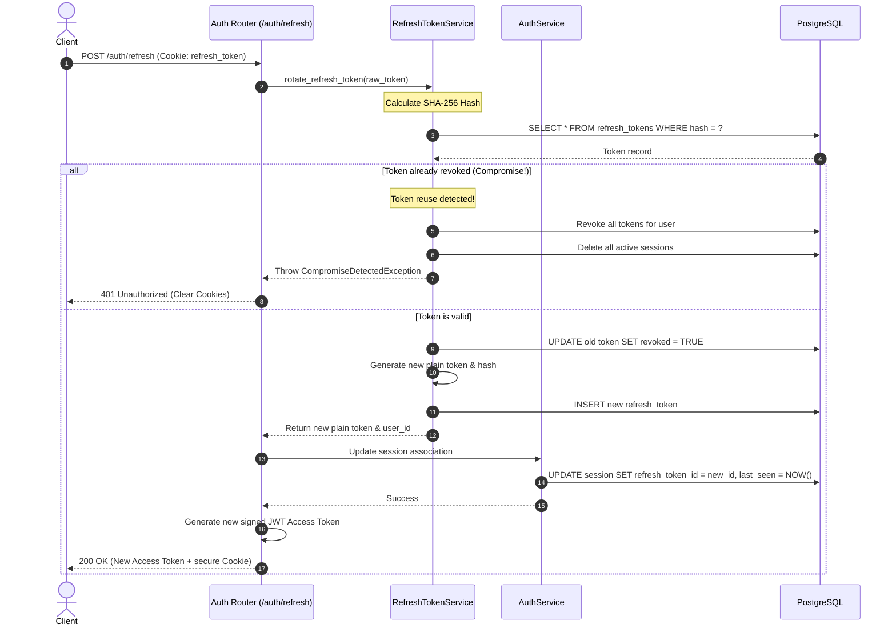
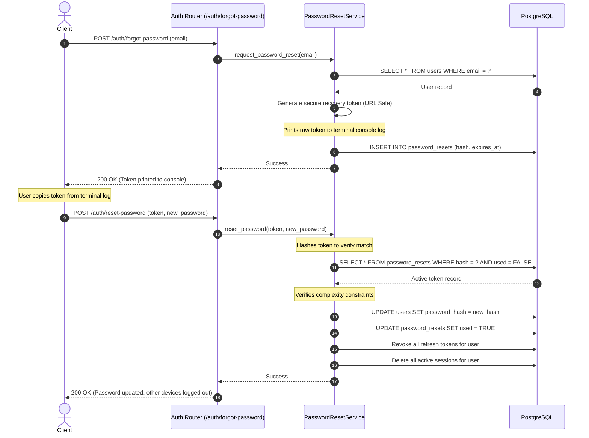

# Task Complete 2: Token, Session, Verification, Password Recovery, & Audit Modules

This document provides a detailed log of the implementation, design decisions, database synchronizations, and validation flows completed under Phase 2 of the **Granthan Auth Service**.

---

## 1. What Was Done

We implemented the complete set of authentication and session lifecycle modules, updated our dependencies, generated database tables, and refactored the security dependency layer.

### Summary of Completed Components:
1. **Installed Cryptographic Libraries:** Added `pyjwt[crypto]` to support secure JSON Web Token (JWT) signatures.
2. **Database Models & Tables Mapped:**
   * [refresh_token.py](file:///c:/Users/hp/Desktop/Granthan/auth-service/app/models/refresh_token.py): Maps `refresh_tokens` to store SHA-256 token hashes.
   * [session.py](file:///c:/Users/hp/Desktop/Granthan/auth-service/app/models/session.py): Maps `sessions` to track user devices, browser types, and IP addresses.
   * [email_verification.py](file:///c:/Users/hp/Desktop/Granthan/auth-service/app/models/email_verification.py): Maps `email_verifications` to manage OTP codes.
   * [password_reset.py](file:///c:/Users/hp/Desktop/Granthan/auth-service/app/models/password_reset.py): Maps `password_resets` to track password recovery tokens.
   * [audit_log.py](file:///c:/Users/hp/Desktop/Granthan/auth-service/app/models/audit_log.py): Maps `audit_logs` using Postgres `JSONB` for log metadata index optimization.
3. **Data Access Layers (Repositories):**
   * Implemented repositories for all models to separate database operations from services: [RefreshTokenRepository](file:///c:/Users/hp/Desktop/Granthan/auth-service/app/repositories/refresh_token_repository.py), [SessionRepository](file:///c:/Users/hp/Desktop/Granthan/auth-service/app/repositories/session_repository.py), [VerificationRepository](file:///c:/Users/hp/Desktop/Granthan/auth-service/app/repositories/verification_repository.py), [PasswordResetRepository](file:///c:/Users/hp/Desktop/Granthan/auth-service/app/repositories/password_reset_repository.py), and [AuditRepository](file:///c:/Users/hp/Desktop/Granthan/auth-service/app/repositories/audit_repository.py).
4. **Security & Hashing Engines:**
   * [jwt_manager.py](file:///c:/Users/hp/Desktop/Granthan/auth-service/app/security/jwt_manager.py): Encapsulates JWT encoding and decoding with signature validations.
   * [token_generator.py](file:///c:/Users/hp/Desktop/Granthan/auth-service/app/security/token_generator.py): Generates cryptographically secure 256-bit hex strings.
5. **Business Services Orchestrations:**
   * [jwt_service.py](file:///c:/Users/hp/Desktop/Granthan/auth-service/app/services/jwt_service.py): Wraps JWT configurations.
   * [refresh_token_service.py](file:///c:/Users/hp/Desktop/Granthan/auth-service/app/services/refresh_token_service.py): Handles Refresh Token Rotation (RTR) and reuse compromise validation.
   * [auth_service.py](file:///c:/Users/hp/Desktop/Granthan/auth-service/app/services/auth_service.py): Login credential checks, device parsing, session creation, and logout.
   * [verification_service.py](file:///c:/Users/hp/Desktop/Granthan/auth-service/app/services/verification_service.py): Handles 6-digit numeric OTP generation, logs code to terminal in development, and activates users to `ACTIVE` status on validation.
   * [password_reset_service.py](file:///c:/Users/hp/Desktop/Granthan/auth-service/app/services/password_reset_service.py): Recovery workflows, logs tokens to terminal in development, and **force logs out all active user sessions & refresh tokens** on reset.
   * [audit_service.py](file:///c:/Users/hp/Desktop/Granthan/auth-service/app/services/audit_service.py): Asynchronously logs lifecycle operations.
6. **FastAPI Integrations & Route Handlers:**
   * [deps.py](file:///c:/Users/hp/Desktop/Granthan/auth-service/app/api/deps.py): Refactored `get_current_user` to verify signed bearer JWTs.
   * [auth.py](file:///c:/Users/hp/Desktop/Granthan/auth-service/app/api/routers/auth.py): Implemented endpoints `/login`, `/refresh`, `/logout`, `/verify-email`, `/resend-verification`, `/forgot-password`, `/reset-password` with audit logs.
   * [users.py](file:///c:/Users/hp/Desktop/Granthan/auth-service/app/api/routers/users.py): Integrated audit logs on profile and password updates.

---

## 2. Why It Was Done

* **Refresh Token Rotation (RTR) Security:** To prevent token theft, when a client calls `/refresh`, the old refresh token is revoked, and a new refresh token is issued.
* **Token Reuse Detection:** If an attacker steals a refresh token and tries to reuse it after rotation, the server detects that the token is already revoked, identifies a compromise, and immediately invalidates all refresh tokens and sessions belonging to that user.
* **XSS & CSRF Mitigation:** 
  * The `refresh_token` is stored inside a secure `HttpOnly` cookie (preventing JavaScript from reading it).
  * `SameSite=Strict` ensures the cookie is never sent along with cross-site requests, blocking CSRF attacks.
  * The `access_token` is returned in the JSON body and stored in-memory.
* **Development Sandbox isolation:** Printing OTP codes and recovery tokens directly to the terminal console during development allows testing all onboarding and recovery flows without setting up email servers or message queues.

---

## 3. How It Was Done

### 3.1 Token Rotation & Session Update Loop
This diagram shows the sequence when a client rotates their token to stay logged in:



### 3.2 Password Recovery Flow (Forgotten Password)
This sequence shows requesting a password reset, retrieving the recovery token, and performing the reset which invalidates other active sessions.



---

## 4. Code Highlights & Explanations

### 4.1 Token Reuse & Compromise Detection Logic
Located in: [app/services/refresh_token_service.py](file:///c:/Users/hp/Desktop/Granthan/auth-service/app/services/refresh_token_service.py)

```python
        # Check expiration
        now = datetime.now(timezone.utc)
        expires_at = db_token.expires_at.replace(tzinfo=timezone.utc)
        if expires_at < now:
            session = await SessionRepository.get_by_refresh_token_id(db, db_token.id)
            if session:
                await SessionRepository.delete_by_id(db, session.id)
            raise InvalidTokenException("Refresh token has expired.")

        # COMPROMISE DETECTION: If token is already revoked, it means it's being reused!
        if db_token.revoked:
            # Revoke all tokens and delete all active sessions for this user immediately
            await RefreshTokenRepository.revoke_all_for_user(db, db_token.user_id)
            await SessionRepository.delete_all_for_user(db, db_token.user_id)
            raise CompromiseDetectedException()
```
* **Why it matters:** If an attacker steals a user's refresh token and rotates it, the real user's browser still holds the *old* refresh token. When the real user's browser attempts to use the old token, this block intercepts the query, detects the reuse, and immediately logs out both the user and the attacker across all devices to lock down the account.

### 4.2 Secure Cookie and Token Distribution
Located in: [app/api/routers/auth.py](file:///c:/Users/hp/Desktop/Granthan/auth-service/app/api/routers/auth.py)

```python
        # Set refresh token cookie securely
        response.set_cookie(
            key="refresh_token",
            value=refresh_token,
            httponly=True,       # Prevents JavaScript reading (blocks XSS)
            secure=True,         # Transmits only over HTTPS
            samesite="strict",   # Blocks cross-site transmission (blocks CSRF)
            path="/",            # Accessible across auth endpoints
            max_age=30 * 24 * 60 * 60  # 30 days
        )
```
* **Why it matters:** Enforces the hybrid token storage architecture. The `access_token` remains short-lived and in-memory, while the `refresh_token` is stored as an encrypted-in-transit, script-inaccessible cookie, providing maximum security posture.
