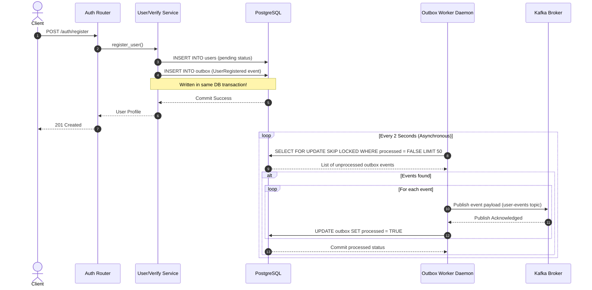
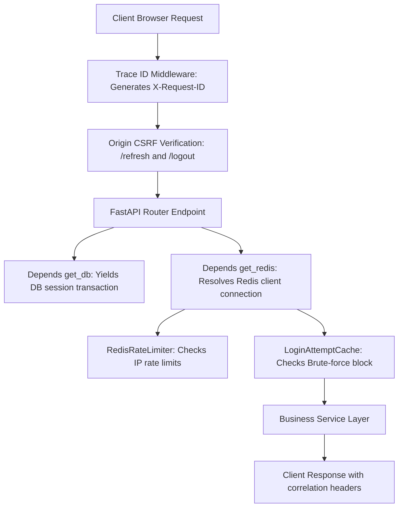

# Task Complete 3: Session APIs, Transactional Outbox, Caching, & Security Middlewares (with Pure DI)

This document provides a detailed log of the implementation, architecture diagrams, and design decisions for the final structural integration phase of the **Granthan Auth Service**.

---

## 1. What Was Done

We implemented the remaining system components (Sessions APIs, Transactional Outbox, Redis Rate Limiting, and CORS/CSRF/Trace ID Middlewares) and refactored the caching and security libraries to adhere strictly to the **Dependency Injection (DI)** pattern.

### Completed Components:
1. **Docker Container Stack:** Defined `docker-compose.yml` for Zookeeper, Kafka, and Redis.
2. **Session Management Endpoints:** Added endpoints `/auth/sessions`, `/auth/sessions/{id}`, and `/auth/sessions` (with optional current-session exclusion) to manage active user sessions.
3. **Transactional Outbox Pattern (Kafka Integration):**
   * Mapped the `Outbox` database model.
   * Built the background polling worker daemon executing `select FOR UPDATE SKIP LOCKED` for concurrent safety.
   * Integrated transactional `OutboxPublisher` hooks inside registration, email verification, and password reset services.
4. **Redis Caching & Lockouts:** Added a Redis connection pool, brute-force lockout protection (5 failed attempts locks the user out for 30 minutes), and an IP-based request rate limiter.
5. **Security Middlewares:** Log correlation trace IDs (`X-Request-ID`), HSTS clickjacking denial headers, and strict `Origin` header CSRF validation on token rotations.
6. **Dependency Injection (DI) Refactoring:** Decoupled `LoginAttemptCache` and `RedisRateLimiter` from `RedisClient`. They now receive the `redis` connection client as an injected parameter from FastAPI's dependency generator `Depends(get_redis)`.

---

## 2. Architectural Workflows

### 2.1 Transactional Outbox Event-Driven Flow
Ensures **At-Least-Once Delivery** of critical identity lifecycle events to Kafka without using distributed transactions (2PC):



### 2.2 FastAPI Dependency Injection & Middleware Lifecycle
This diagram show the path of a client request resolving dependencies and passing validation:



---

## 3. Code Design Decisions

### 3.1 Strict Dependency Injection Refactoring
By exposing the `get_redis` dependency and passing the connection parameter down, we avoided tight coupling:

* **Injected Dependency Definition** ([deps.py](file:///c:/Users/hp/Desktop/Granthan/auth-service/app/api/deps.py)):
  ```python
  from redis.asyncio import Redis
  from app.cache.redis import RedisClient

  async def get_redis() -> Redis | None:
      """Dependency that returns the active Redis client connection instance."""
      return await RedisClient.get_client()
  ```
* **Decoupled Cache Utility** ([login_attempt_cache.py](file:///c:/Users/hp/Desktop/Granthan/auth-service/app/cache/login_attempt_cache.py)):
  ```python
  class LoginAttemptCache:
      @classmethod
      async def increment_failed_attempts(cls, email: str, redis: Redis | None = None) -> int:
          key = f"failed_attempts:{email.lower()}"
          if redis:
              count = await redis.incr(key)
              # ...
  ```
* **Decoupled Rate Limiter** ([rate_limiter.py](file:///c:/Users/hp/Desktop/Granthan/auth-service/app/security/rate_limiter.py)):
  ```python
  class RedisRateLimiter:
      @classmethod
      async def check_rate_limit(cls, request, endpoint_name, limit, window, redis: Redis | None = None):
          # ...
  ```

---

## 4. Verification & Clean Compile
We checked bindings, routes, and database integration structures:
```powershell
python -m py_compile app/models/outbox.py app/events/producer.py app/events/outbox_publisher.py app/workers/outbox_worker.py app/cache/redis.py app/cache/login_attempt_cache.py app/security/rate_limiter.py app/api/middleware.py app/api/routers/sessions.py app/main.py
```
**Status:** Output completed successfully with exit code 0.
